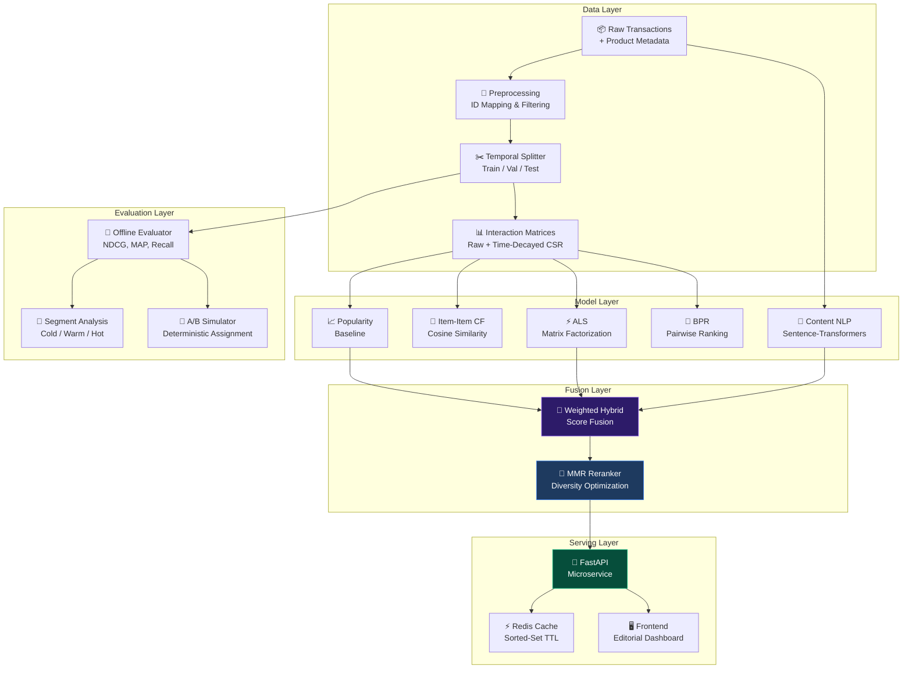
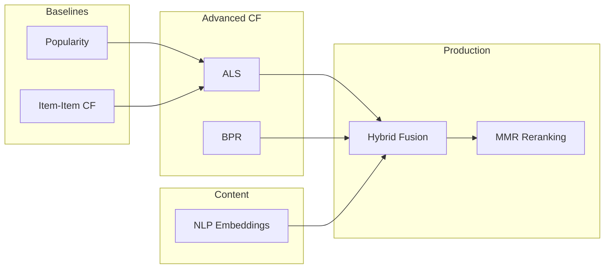
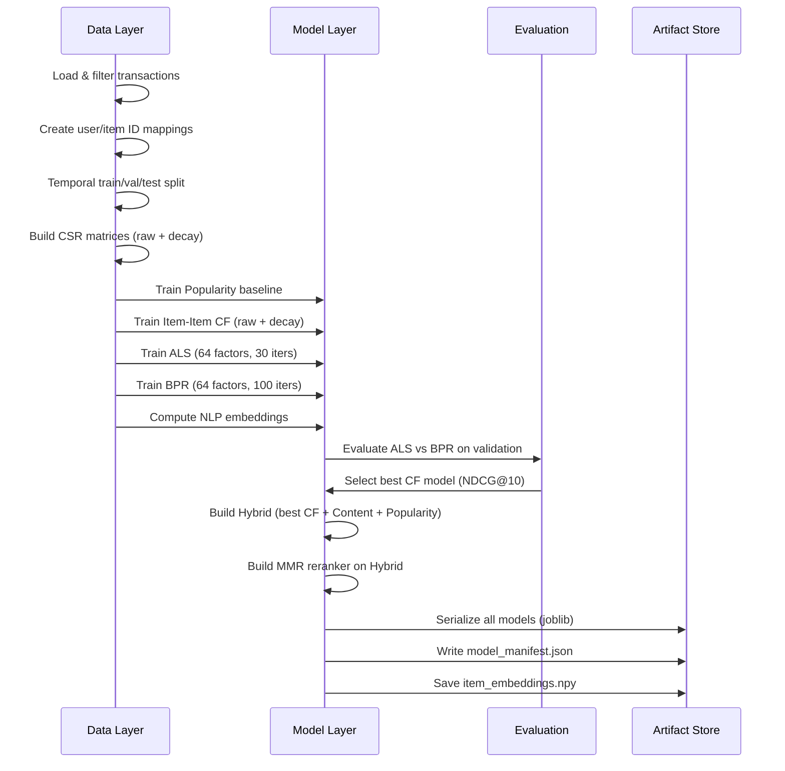

<p align="center">
  <strong>◈ ShopSense</strong><br/>
  <em>Hybrid E-Commerce Recommendation Engine</em>
</p>

<p align="center">
  
  
  
  
  
</p>

---

ShopSense is a **production-grade hybrid recommendation system** built on the [H&M Personalized Fashion Recommendations](https://www.kaggle.com/competitions/h-and-m-personalized-fashion-recommendations) dataset. It implements a complete **Retrieval → Ranking → Reranking** pipeline — from raw transaction logs to a live, API-served recommendation engine with a premium editorial frontend.

The system fuses **six distinct models** (Popularity, Item-Item CF, ALS, BPR, NLP Content Embeddings, Hybrid Ensemble) and applies **Maximal Marginal Relevance (MMR)** reranking for diversity — all evaluated with rigorous offline metrics and served through a Redis-cached FastAPI microservice.

---

## Table of Contents

- [System Architecture](#system-architecture)
- [End-to-End Pipeline](#end-to-end-pipeline)
- [Model Catalogue](#model-catalogue)
- [Project Structure](#project-structure)
- [Setup & Installation](#setup--installation)
- [Data Preparation](#data-preparation)
- [Training Pipeline](#training-pipeline)
- [Offline Evaluation](#offline-evaluation)
- [API Serving](#api-serving)
- [Frontend Dashboard](#frontend-dashboard)
- [Security](#security)
- [Testing](#testing)
- [Docker Deployment](#docker-deployment)
- [Technical Decisions](#technical-decisions)
- [Scope & Limitations](#scope--limitations)

---

## System Architecture



---

## End-to-End Pipeline

The system follows a strict, reproducible pipeline from raw data to live recommendations:


| Stage | Script | Output |
|---|---|---|
| **Data Prep** | `scripts/setup_data.py` | `data/raw/*.csv` |
| **Preprocessing** | Handled internally by `train_all.py` | `data/processed/*.pkl`, `artifacts/*_mapping.pkl` |
| **Training** | `scripts/train_all.py` | `artifacts/models/*.joblib`, `artifacts/model_manifest.json` |
| **Evaluation** | `scripts/evaluate_all.py` | `reports/metrics.json`, `reports/segment_metrics.json` |
| **Serving** | `uvicorn app.main:app` | Live API on `:8000` |
| **Frontend** | `python -m http.server 3000 --directory frontend` | Live UI on `:3000` |

---

## Model Catalogue

| Model | Type | Matrix | Key Idea |
|---|---|---|---|
| **Popularity** | Non-personalized | Raw | Recommends globally popular items. Cold-start fallback. |
| **Item-Item CF** | Memory-based CF | Raw + Decay | Cosine similarity on the interaction matrix. Two variants: raw and time-decayed. |
| **ALS** | Latent Factor | Time-Decayed | Alternating Least Squares via the `implicit` library. 64 latent factors. |
| **BPR** | Pairwise Ranking | Raw | Bayesian Personalized Ranking — learns a pairwise ordering from implicit feedback. |
| **Content NLP** | Content-based | N/A | Sentence-Transformer (`all-MiniLM-L6-v2`) embeddings on product descriptions. |
| **Hybrid** | Ensemble | Fused | Weighted score fusion: 55% CF + 30% Content + 10% Popularity + 5% Freshness. |
| **Hybrid + MMR** | Reranked Ensemble | Fused | MMR (λ=0.75) applied to Hybrid output. Balances relevance with diversity. |

### Why These Models?

The models form a **deliberate progression** that mirrors how real recommendation teams iterate:



---

## Project Structure

```
ShopSense/
├── app/                          # FastAPI serving layer
│   ├── main.py                   # App factory, CORS, security headers, rate limiting
│   ├── api/
│   │   └── routes.py             # API key auth, recommendation & metrics endpoints
│   ├── schemas/
│   │   └── response.py           # Pydantic response models
│   └── services/
│       ├── recommendation.py     # Core recommendation service (artifact-backed)
│       └── cache.py              # Redis sorted-set caching with graceful fallback
│
├── recommender/                  # ML engine (framework-agnostic)
│   ├── artifacts.py              # Model serialization (joblib) & manifest management
│   ├── data/
│   │   ├── loader.py             # Pandas-based CSV data ingestion
│   │   ├── preprocessor.py       # ID mapping, interaction filtering
│   │   ├── splitter.py           # Temporal train/val/test splitting
│   │   └── interaction_matrix.py # Sparse CSR matrix builder (raw + time-decay)
│   ├── models/
│   │   ├── base.py               # Abstract recommender interface
│   │   ├── popularity.py         # Global popularity baseline
│   │   ├── item_item.py          # Item-Item cosine similarity CF
│   │   ├── als_model.py          # ALS via implicit library
│   │   ├── bpr_model.py          # BPR via implicit library
│   │   ├── content.py            # Sentence-Transformer content embeddings
│   │   ├── hybrid.py             # Weighted hybrid score fusion
│   │   └── mmr.py                # Maximal Marginal Relevance reranker
│   ├── evaluation/
│   │   ├── metrics.py            # NDCG, MAP, Recall, Coverage, Diversity, Novelty, Serendipity
│   │   ├── evaluator.py          # Per-user batch evaluation harness
│   │   └── segments.py           # Cold/Warm/Hot user segmentation
│   ├── experiments/
│   │   ├── tracker.py            # MLflow experiment tracking wrapper
│   │   └── ab_simulator.py       # Offline A/B testing with statistical gates
│   ├── monitoring/
│   │   └── drift.py              # Evidently-based distribution drift detection
│   └── serving/
│       └── explainability.py     # Human-readable recommendation reason tags
│
├── frontend/                     # Premium editorial frontend (vanilla HTML/CSS/JS)
│   ├── index.html                # Single-page dashboard
│   ├── style.css                 # Dark-mode editorial design system
│   └── app.js                    # API integration, metrics visualization
│
├── scripts/
│   ├── setup_data.py             # Kaggle dataset downloader
│   ├── train_all.py              # End-to-end training orchestrator
│   ├── evaluate_all.py           # Offline evaluation report generator
│   ├── create_synthetic_data.py  # Synthetic test data generator
│   └── colab_embedder.py         # GPU-accelerated embedding script for Colab
│
├── tests/                        # Pytest test suite
│   ├── test_api.py               # FastAPI route integration tests
│   ├── test_cache.py             # Redis cache logic tests
│   ├── test_metrics.py           # Evaluation math correctness tests
│   ├── test_mmr.py               # MMR diversity tests
│   └── test_splitter.py          # Temporal split tests
│
├── configs/default.yaml          # Hyperparameters, split ratios, model weights
├── Dockerfile                    # Production container (non-root user)
├── .env.example                  # Environment variable template
├── requirements.txt              # Python dependencies
└── pyproject.toml                # Project metadata
```

---

## Live Deployment & Architecture

**🔗 Live Demo:** [https://shopsense-frontend.vercel.app](https://shopsense-frontend.vercel.app)

> **⚠️ Cold Start Warning:** The FastAPI backend is deployed on a **Render Free Tier** instance. Render spins down free web services that go 15 minutes without receiving inbound traffic. **Your first request may take 50–60 seconds** to complete as the container boots up and loads the models into memory. Subsequent requests will be served in <50ms.

### Deployment Challenges & Engineering Solutions

Deploying a multi-model ML system to free-tier cloud providers presented several strict engineering constraints. Here is how they were solved:

1. **Strict CORS Security Spec Conflict**
   - **Problem:** The Vercel frontend requires cross-origin access to the Render backend, but the API Key header requires `allow_credentials=True`. The W3C CORS specification strictly forbids `allow_credentials=True` when `allow_origins=["*"]`, causing browsers to silently block responses.
   - **Solution:** Implemented dynamic CORS middleware that auto-detects wildcard origins and disables credentials, while enabling credentials for specific origin allowlists (like the production Vercel domain), ensuring both local dev flexibility and production security.

2. **Resilient Caching Strategy (Redis vs Free-Tier Quirks)**
   - **Problem:** Managed external Redis instances often use `rediss://` (secure TLS) which can fail strict certificate validation on free tiers. Additionally, network drops between Render and external Redis providers caused silent caching failures.
   - **Solution:** Built a custom `RedisCache` wrapper that gracefully ignores strict SSL requirements for `rediss://` URIs, forces a connection `ping()` on startup to fail-fast, and implements a seamless **in-memory dictionary fallback** when Redis is completely unreachable. This guarantees the API never drops a request due to cache infrastructure failure.

3. **Data Serialization over the Wire**
   - **Problem:** The recommendation engine generates similarity scores using NumPy `float32`, which the standard Python `json` module cannot serialize when attempting to cache to Redis.
   - **Solution:** Ensured the ML pipeline normalizes and explicitly casts all NumPy types to native Python types before they reach the serving layer or cache, ensuring seamless JSON serialization and Pydantic validation across the stack.

---

## Setup & Installation If you want to test it locally on your own machine.

### Prerequisites

- **Python 3.11+**
- **Git**
- **Redis** (optional — the API degrades gracefully without it)

### Step-by-Step

```powershell
# 1. Clone the repository
git clone https://github.com/Akshansh0519/ShopSense.git
cd ShopSense

# 2. Create and activate a virtual environment
python -m venv .venv
.\.venv\Scripts\Activate.ps1       # Windows PowerShell
# source .venv/bin/activate        # macOS/Linux

# 3. Install dependencies
pip install -r requirements.txt

# 4. Configure environment variables
copy .env.example .env
# Edit .env and set a secure API_KEY:
#   python -c "import secrets; print(secrets.token_hex(32))"
```

---

## Data Preparation

ShopSense uses the **H&M Personalized Fashion Recommendations** dataset from Kaggle (~3.7 GB).

### Option A: Automatic Download (Kaggle API)

```powershell
# Requires ~/.kaggle/kaggle.json to be configured
python scripts/setup_data.py
```

### Option B: Manual Download

Download from [Kaggle](https://www.kaggle.com/competitions/h-and-m-personalized-fashion-recommendations/data) and place the files:

```
data/raw/
├── transactions_train.csv    # 31M+ purchase records
├── articles.csv              # 105K product descriptions
└── customers.csv             # 1.3M customer profiles
```

### Option C: Synthetic Data (Quick Testing)

```powershell
python scripts/create_synthetic_data.py
```

Generates small synthetic CSV files for rapid local testing without the full Kaggle dataset.

---

## Training Pipeline

The training script orchestrates the complete ML pipeline in one command:

```powershell
python scripts/train_all.py            # Uses cached artifacts if available
python scripts/train_all.py --force    # Force retrain everything
python scripts/train_all.py --full     # Full validation (no user sampling)
```

### What It Does



### Output Artifacts

```
artifacts/
├── models/
│   ├── popularity.joblib
│   ├── item_item_raw.joblib
│   ├── item_item_decay.joblib
│   ├── als.joblib
│   ├── bpr.joblib
│   ├── content.joblib
│   ├── hybrid.joblib
│   └── hybrid_mmr.joblib
├── model_manifest.json          # Active model version, best CF model, metadata
├── item_embeddings.npy          # NLP embedding matrix (91K × 384)
├── user_mapping.pkl             # User ID → index mapping
└── item_mapping.pkl             # Item ID → index mapping
```

---

## Offline Evaluation

```powershell
python scripts/evaluate_all.py            # Uses cached reports if available
python scripts/evaluate_all.py --force    # Force recalculate
```

### Metrics Computed

| Metric | What It Measures |
|---|---|
| **NDCG@10** | Ranking quality — rewards correct items ranked higher |
| **MAP@10** | Average precision across users |
| **Recall@10** | Fraction of relevant items retrieved |
| **Precision@10** | Fraction of recommended items that are relevant |
| **Coverage@10** | Fraction of the item catalogue recommended across all users |
| **Novelty@10** | Average self-information of recommended items (penalizes popular picks) |
| **Diversity@10** | Intra-list diversity via pairwise embedding distance |
| **Serendipity@10** | Relevant items that deviate from expected popularity patterns |

### User Segmentation

Users are segmented by interaction count to evaluate performance across activity levels:

| Segment | Interactions | Challenge |
|---|---|---|
| **Cold** | 3–5 | Sparse signal, cold-start problem |
| **Warm** | 6–20 | Moderate signal, typical user |
| **Hot** | 21+ | Dense signal, risk of filter bubble |

---

## API Serving

### Start the API

```powershell
# Terminal 1: FastAPI backend
.\.venv\Scripts\uvicorn app.main:app --host 0.0.0.0 --port 8000 --reload
```

### API Endpoints

| Method | Endpoint | Auth | Description |
|---|---|---|---|
| `GET` | `/health` | None | Health check |
| `GET` | `/models/current` | API Key | Active model info |
| `GET` | `/recommendations/{user_id}?k=10` | API Key | Get top-k recommendations |
| `GET` | `/recommendations/{user_id}?k=5&category=Tops` | API Key | Category-filtered recommendations |
| `GET` | `/metrics` | None | Offline evaluation metrics |
| `GET` | `/metrics/segments` | None | Per-segment evaluation metrics |
| `POST` | `/events` | API Key | Stub for A/B event logging |
| `GET` | `/docs` | None (dev only) | Swagger UI (disabled in production) |

### Example Request

```bash
curl -H "X-API-Key: YOUR_API_KEY" \
     "http://localhost:8000/recommendations/54321?k=5"
```

### Example Response

```json
{
  "user_id": "54321",
  "recommendations": [
    {
      "rank": 1,
      "item_id": "0706016001",
      "score": 0.847,
      "reason": "Users who bought similar items also purchased this",
      "signals": { "cf": 0.62, "content": 0.18, "popularity": 0.05 }
    }
  ],
  "model_version": "hybrid_mmr_v1",
  "cached": false,
  "latency_ms": 42.3
}
```

---

## Frontend Dashboard

The frontend is a handcrafted editorial-style dark-mode dashboard — no Streamlit, no React, just clean vanilla HTML/CSS/JS.

### Start the Frontend

```powershell
# Terminal 2: Frontend server
python -m http.server 3000 --directory frontend
```

Then open **http://localhost:3000** in your browser.

### Features

- **Live API Demo** — Enter a User ID, adjust K and category filters, and see real recommendations
- **Signal Breakdown** — Visual decomposition of CF, Content, and Popularity score contributions
- **Model Metrics** — Tab through all 8 trained models with live NDCG, MAP, Recall, Precision, Coverage, Novelty, Diversity, and Serendipity bars
- **Architecture Visualization** — Interactive view of the Retrieval → Ranking → Reranking pipeline
- **Responsive Design** — Works on desktop and tablet

---

## Security

ShopSense implements multiple layers of API security:

| Layer | Implementation |
|---|---|
| **Authentication** | API key validation via `X-API-Key` header |
| **Rate Limiting** | `slowapi` rate limiter keyed by client IP |
| **CORS** | Explicit origin allowlist (no wildcard `*`) |
| **Security Headers** | `X-Content-Type-Options`, `X-Frame-Options`, `X-XSS-Protection`, `Referrer-Policy`, `Cache-Control` |
| **Input Validation** | User ID length capped at 128 chars, K capped at 50 |
| **Secrets Management** | `.env` file excluded from Git, `.env.example` template provided |
| **Production Hardening** | Swagger UI disabled when `APP_ENV=production` |
| **Container Security** | Dockerfile runs as non-root `appuser` |

---

## Testing

```powershell
pytest tests/ -v
```

Tests use synthetic fixtures and **do not** require the full H&M dataset or Redis.

| Test File | Coverage |
|---|---|
| `test_metrics.py` | NDCG, MAP, Recall math correctness |
| `test_mmr.py` | MMR diversity reranking logic |
| `test_splitter.py` | Temporal split integrity |
| `test_api.py` | FastAPI route integration |
| `test_cache.py` | Redis caching fallback behavior |

---

## Docker Deployment

```powershell
# Build and run
docker build -t shopsense .
docker run -p 8000:8000 --env-file .env shopsense

# Or verify the health check
curl http://localhost:8000/health
```

The Dockerfile uses `python:3.11-slim`, creates a non-root user, and runs `uvicorn` in production mode.

---

## Technical Decisions

| Decision | Rationale |
|---|---|
| **Temporal splitting** over random | Random splits leak future interactions into training, inflating metrics dishonestly |
| **Validation-based CF selection** | ALS and BPR are compared on a held-out validation set; the winner is selected automatically for the Hybrid |
| **MMR reranking (λ=0.75)** | Balances relevance (75%) with diversity (25%) to reduce filter bubbles |
| **Redis sorted-set caching** | Sub-50ms cache hits for repeated queries; graceful degradation if Redis is unavailable |
| **Sentence-Transformers** over TF-IDF | Dense 384-dim embeddings capture semantic similarity far better than sparse bag-of-words |
| **joblib** over pickle | Faster serialization for numpy-heavy model objects; safer than raw pickle |
| **Static frontend** over Streamlit | Deployable anywhere (GitHub Pages, S3, Nginx); no Python runtime required in production |
| **API key auth** over OAuth | Appropriate for internal/demo APIs; avoids OAuth complexity for a portfolio project |

---

## Scope & Limitations

> **Transparency note:** This is a portfolio project demonstrating ML engineering depth, not a production deployment.

- **Offline evaluation only.** Metrics are computed on temporal held-out test sets, not live A/B traffic.
- **Simulated A/B testing.** The A/B simulator uses deterministic hash-based assignment on historical data.
- **Local serving.** The FastAPI server is designed for local or Docker deployment, not cloud-scale.
- **Drift monitoring is a prototype.** The Evidently-based drift module generates offline reports, not real-time alerts.
---

## Some Good Articles to read and understand
```
**Phase 1 — Foundations**

1. ⭐⭐⭐ Why We Use Sparse Matrices for Recommender Systems
https://medium.com/data-science/why-we-use-sparse-matrices-for-recommender-systems-2ccc9ab698a4

2. ⭐⭐⭐ ALS Implicit Collaborative Filtering (implicit vs explicit feedback)
https://medium.com/radon-dev/als-implicit-collaborative-filtering-5ed653ba39fe

3. ⭐⭐ Cold Start Problem in Recommender Systems
https://medium.com/@kumarkishalaya/cold-start-problem-in-recommender-systems-and-how-to-deal-with-them-ea2ec841440e

---

**Phase 2 — Individual Models**

4. ⭐⭐ Comprehensive Guide on Item-Based Collaborative Filtering
https://medium.com/data-science/comprehensive-guide-on-item-based-recommendation-systems-d67e40e2b75d

5. ⭐⭐⭐ Prototyping a Recommender System Step by Step Part 2: ALS Matrix Factorization
https://medium.com/data-science/prototyping-a-recommender-system-step-by-step-part-2-alternating-least-square-als-matrix-4a76c58714a1

6. ⭐⭐⭐ Getting Started with Recommender Systems (implicit library — ALS + BPR in code)
https://medium.com/swlh/getting-started-with-recommender-systems-5ad8846c280b

7. ⭐⭐⭐ Recommender System — Bayesian Personalized Ranking from Implicit Feedback
https://medium.com/data-science/recommender-system-bayesian-personalized-ranking-from-implicit-feedback-78684bfcddf6

8. ⭐⭐ Sentence Transformers Semantic Search (official docs)
https://www.sbert.net/examples/sentence_transformer/applications/semantic-search/README.html

---

**Phase 3 — Combining Models**

9. ⭐⭐⭐ Building a Hybrid Recommendation System: Combining CF, Content-Based, and Matrix Factorization
https://medium.com/@Emar7/building-a-hybrid-recommendation-system-combining-collaborative-filtering-content-based-and-6be4e400ec3c

10. ⭐⭐⭐ Diversity in Recommendations — Maximal Marginal Relevance (MMR)
https://medium.com/data-science-collective/diversity-in-recommendations-maximal-marginal-relevance-mmr-0e7840c9399e

---

**Phase 4 — Evaluation**

11. ⭐⭐⭐ Splitting Data for Recommender Evaluation (temporal splits)
https://apxml.com/courses/building-ml-recommendation-system/chapter-5-evaluating-recommendation-systems/splitting-data-for-evaluation

12. ⭐⭐⭐ Evaluation Metrics for Search and Recommendation Systems (NDCG, MAP, Recall)
https://weaviate.io/blog/retrieval-evaluation-metrics

---

**Phase 5 — Full Pipeline View**

13. ⭐⭐⭐ One-Stop Guide for Production Recommendation Systems
https://medium.com/@zaiinn440/one-stop-guide-for-production-recommendation-systems-9491f68d92e3

14. ⭐⭐ Building a Hybrid Recommender System: Balancing Accuracy, Coverage, and Diversity
https://medium.com/@sanjeeda.jeba/building-a-hybrid-recommender-system-balancing-accuracy-coverage-and-diversity-e306157a4012

---

**Phase 6 — Infrastructure**

15. ⭐⭐ Mastering MLflow: From Experiment Tracking to Production-Ready MLOps
https://mohamed-stifi.medium.com/mastering-mlflow-the-complete-mlops-workflow-from-experiment-to-production-3b78b8c8abe1

16. ⭐⭐⭐ ML Model Serving with FastAPI and Redis for Faster Predictions
https://www.analyticsvidhya.com/blog/2025/06/ml-model-serving/

17. ⭐⭐ Redis Design Patterns for Caching and Session Management
https://medium.com/@artemkhrenov/key-value-store-patterns-redis-design-patterns-for-caching-and-session-management-418d91148701

---

**Phase 7 — Original Papers (optional)**

18. ⭐ Collaborative Filtering for Implicit Feedback Datasets — Hu, Koren, Volinsky
https://yifanhu.net/PUB/cf.pdf

19. ⭐ BPR: Bayesian Personalized Ranking from Implicit Feedback — Rendle et al.
https://arxiv.org/abs/1205.2618

---

**Quick guide:** ⭐⭐⭐ = must read (10 articles), ⭐⭐ = read if time allows (7 articles), ⭐ = skip unless you want the math (2 papers). The 10 three-star articles alone give you solid coverage of everything in ShopSense.
```
<p align="center">
  Built with intention by <strong>Akshansh Ranjan</strong>
</p>
